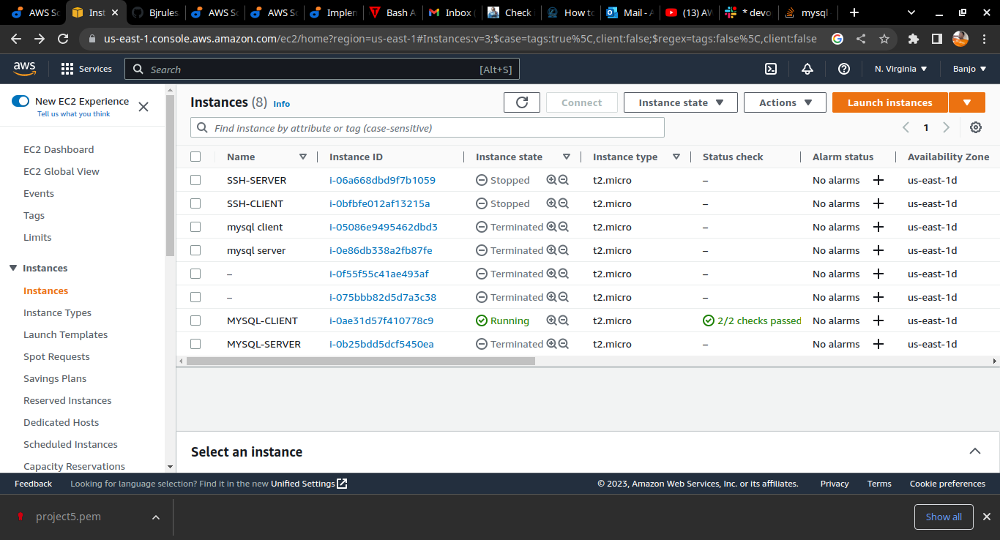
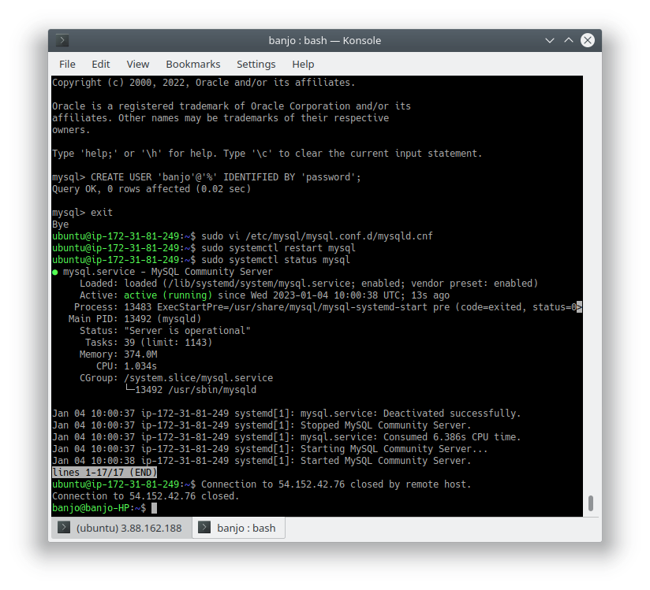
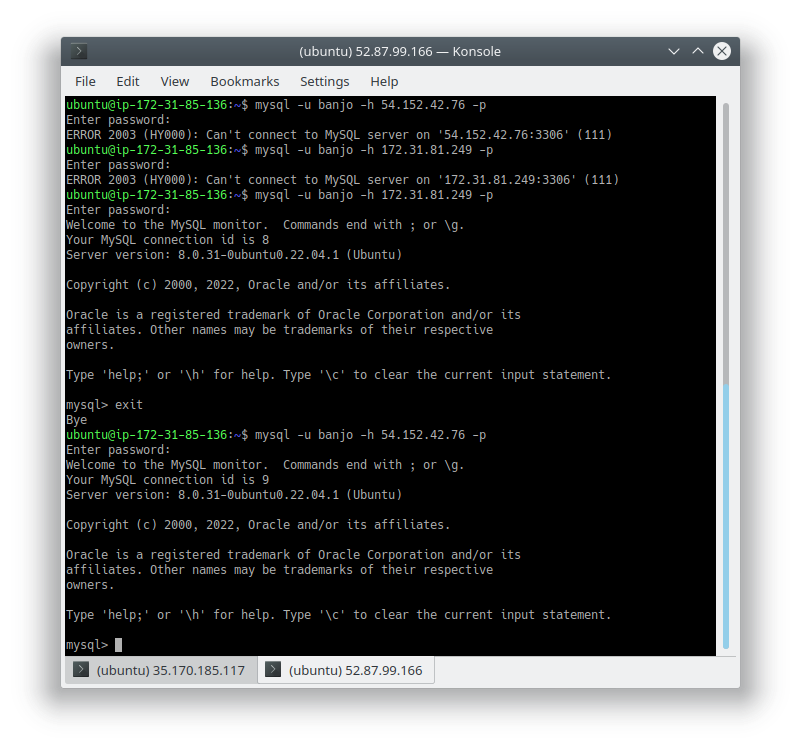

#### This is Project5 
1. i created two EC2 instances at once, and rename one as MYSQL-ERVER AND THE OTHER AS SQL-CLIENT.
2. 
3. firstly I did **sudo apt update** 
4. **secondly sudo apt upgrade** to upgrade ubuntu
5. then i used **sudo apt install mysql-client** to install the client
6. **sudo apt install mysql-server** to install the server
7. edited inbound rule in the security group using MYSQL/Aurora on port 3306 and connect from anywhere Ipv4 , then save.
8. then on terminal of the server **sudo mysql** then on mysql interface, 
9. since I cannot have root access from a remote IP i created a user using **CREATE USER 'banjo'@'%' IDENTIFIED BY 'password';**
10. I also modified my configuration file on the server using **sudo vi /etc/mysql/mysql.conf.d/mysqld.cnf**
11. went to my SQL-CLIENT ECS and typed ** mysql -u banjo -h <public or Private IP Address> -p
12. I entered password and ... yipeeeee.......Successful!
13. 
14. 

####You can make it 
#### Banjo babade @darey.io
